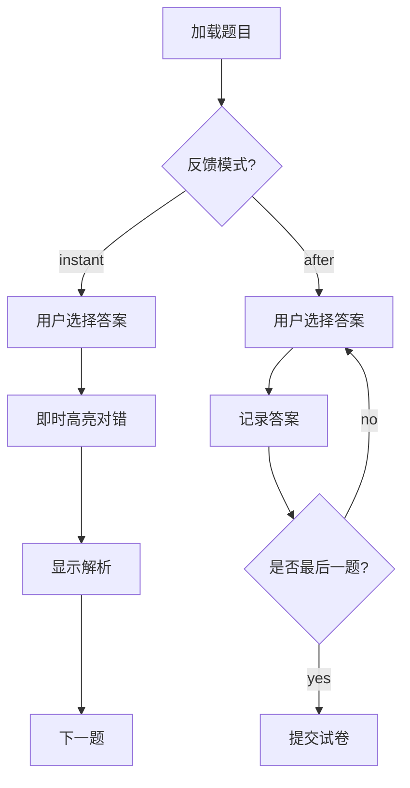

### 📘 小测应用 (Mini-Test App) 系统设计文档 (v1.1 - P0)

**版本**: 1.1  
**日期**: 2026-05-06  
**状态**: 冻结（P0 阶段）

---

### 1. 修订记录 (Changelog)

| 版本 | 日期 | 变更内容 | 影响模块 |
|---|---|---|---|
| 1.0 | 2026-05-06 | 初稿 | 全系统 |
| **1.1** | **2026-05-06** | **新增：显示逻辑（即时/考后）、计分体系（考试/游戏）** | **前端、后端、算法、DB** |

---

### 2. 项目概述 (Project Overview)

#### 2.1 项目愿景
构建一个支持 **Web / 小程序** 的在线组卷测试系统。用户可通过上传 **TXT/MD** 格式题库，系统自动解析并支持随机组卷、在线答题、自动判分，并记录用户的测试历史。

#### 2.2 P0 阶段核心目标
1.  **双端支持**：UniApp 一套代码生成 Web + 小程序。
2.  **题库解析**：支持 TXT 和 MD 两种格式的解析入库。
3.  **双模反馈**：支持**即时反馈**（选完即看对错）与**考后反馈**（交卷后统一看）。
4.  **双模计分**：支持**考试型**（百分制）与**游戏型**（HP/闯关制）。
5.  **数据闭环**：记录测试情况（云端）。

---

### 3. 用户故事 (User Stories)

*   **作为** 用户，**我希望** 能上传 TXT/MD 文件，**以便于** 快速建立题库。
*   **作为** 用户，**我希望** 能选择“即时显示答案”或“考后显示”，**以便于** 适应不同复习场景。
*   **作为** 用户，**我希望** 能选择“游戏模式”答题，**以便于** 增加刷题的趣味性和挑战性。
*   **作为** 用户，**我希望** 系统能记录我的测试历史和得分详情，**以便于** 追踪进步。

---

### 4. 系统架构 (System Architecture)

```
┌──────────────────────────┐
│       UniApp (Vue3)       │  ← 前端 (Web / 小程序)
│  - ExamPage (状态机)     │
│  - ResultPage            │
└─────────────┬────────────┘
              │ HTTPS (RESTful API)
              ▼
┌──────────────────────────┐
│      FastAPI (Python)     │  ← 后端服务
│  ┌──────────┬──────────┐ │
│  │ 题库解析模块 │ 组卷算法 │ │
│  ├──────────┼──────────┤ │
│  │ ScoreCalculator (策略)│ │  ← 新增：计分策略模式
│  └──────────┴──────────┘ │
└─────────────┬────────────┘
              │ SQLAlchemy
              ▼
┌──────────────────────────┐
│       MySQL 8.0          │  ← 数据存储
└──────────────────────────┘
```

---

### 5. 数据模型设计 (Data Models)

#### 5.1 数据库表结构 (MySQL)

**`question_banks` (题库表) - 无变化**
| 字段名 | 类型 | 说明 |
|---|---|---|
| `id` | INT PK | 题库ID |
| `name` | VARCHAR(100) | 题库名称 |
| `source_type` | ENUM('txt', 'md') | 来源格式 |
| `created_at` | DATETIME | 创建时间 |

**`questions` (题目表) - 无变化**
| 字段名 | 类型 | 说明 |
|---|---|---|
| `id` | INT PK | 题目ID |
| `bank_id` | INT FK | 所属题库ID |
| `type` | VARCHAR(20) | `single_choice` / `multi_choice` |
| `content` | TEXT | 题干 |
| `options` | JSON | `["A. let", ...]` |
| `answer` | JSON | `["A", "C"]` |
| `explanation` | TEXT | 解析 |

**`test_records` (测试记录表) - ✅ 更新**
| 字段名 | 类型 | 说明 |
|---|---|---|
| `id` | INT PK | 记录ID |
| `user_id` | INT | 用户ID (预留) |
| `bank_id` | INT | 所用题库 |
| `scoring_mode` | ENUM('exam', 'game') | **新增：计分模式** |
| `feedback_mode` | ENUM('instant', 'after') | **新增：反馈模式** |
| `score` | INT | 最终得分 (考试: 0-100, 游戏: HP值) |
| `details` | JSON | **新增：详细记录** |
| `test_time` | DATETIME | 测试时间 |

*`details` 字段示例:*
```json
{
  "correct_count": 8,
  "wrong_count": 2,
  "skipped_count": 0,
  "max_streak": 5,
  "wrong_ids": [12, 35],
  "answer_log": [...] 
}
```

---

### 6. 核心算法与逻辑 (Core Logic)

#### 6.1 题库解析 (TXT Format)
**定义严格格式**:
```
Q: [题干]
A. [选项A]
B. [选项B]
ANS: [A,C]
EXP: [解析内容]
---
```

#### 6.2 组卷算法
```sql
SELECT * FROM questions WHERE bank_id = :bank_id ORDER BY RAND() LIMIT :count;
```

#### 6.3 判分系统（核心更新）
采用**策略模式 (Strategy Pattern)** 解耦算法。

**A. 考试型 (Exam Mode)**
*   **规则**: 传统百分制。
*   **公式**:
    $$Score = \frac{CorrectCount}{TotalCount} \times 100$$

**B. 游戏型 (Game Mode)**
*   **规则**: 初始 HP/Score，包含惩罚与奖励。
*   **数据结构**:
    ```json
    { "init_score": 100, "wrong_penalty": -10, "streak_bonus": { "3": 5, "5": 15 } }
    ```
*   **伪代码**:
    ```python
    def calculate_game_score(answers, rules):
        score = rules.init_score
        streak = 0
        for ans in answers:
            if ans.is_correct:
                streak += 1
                score += rules.streak_bonus.get(streak, 0)
            else:
                streak = 0
                score += rules.wrong_penalty
        return max(0, score)
    ```

---

### 7. API 接口设计 (API Endpoints)

| 功能 | Method | Endpoint | 请求体 (Request Body) | 响应体 (Response Body) |
|---|---|---|---|---|
| 上传题库 | `POST` | `/api/banks/upload` | `file` | `{ "bank_id": 1 }` |
| 组卷 | `POST` | `/api/exams/generate` | `{ "bank_id": 1, "count": 10, "scoring_mode": "game", "feedback_mode": "instant" }` | `{ "exam_id": "uuid", "questions": [...] }` |
| 提交判分 | `POST` | `/api/exams/submit` | `{ "exam_id": "...", "answers": {...} }` | `{ "score": 85, "details": {...} }` |

---

### 8. 前端交互逻辑 (Frontend Logic)

#### 8.1 答题页面状态机


#### 8.2 显示逻辑
*   **即时模式**:
    *   选中选项后，立即禁用其他选项。
    *   正确选项标绿，错误选项标红。
    *   解析区域展开。
*   **考后模式**:
    *   答题过程中无视觉反馈。
    *   提交后跳转到结果页，展示得分和错题列表。

---

### 9. 技术栈选型 (Tech Stack)

| 层级 | 技术 | 理由 |
|---|---|---|
| **前端** | UniApp (Vue3 + Composition API) | 双端发布，响应式状态管理适合复杂交互 |
| **后端** | FastAPI | Python 生态适合解析/算法，类型提示友好 |
| **ORM** | SQLAlchemy | 成熟稳定 |
| **数据库** | MySQL | 关系型数据，事务支持好 |
| **解析库** | `re` (正则) | TXT/MD 解析核心 |

---

### 10. 下一步行动计划 (Action Plan)

1.  **环境搭建**: 初始化 FastAPI 和 UniApp 项目。
2.  **数据库**: 执行更新后的 `CREATE TABLE` SQL。
3.  **后端核心**:
    *   实现 `ScoreCalculator` 策略类。
    *   实现 `/upload` 和 `/generate` 接口。
4.  **前端核心**:
    *   实现 `ExamPage.vue` 的状态机逻辑。
    *   实现两种反馈模式的 UI 切换。

-